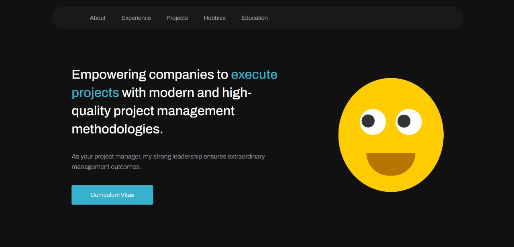

<h1 align="center">
  💻 Portfolio - Jawad, beji
</h1>

<h4 align="center"><a href="https://www.beji.space/">Click to visit the project</a></h4>

## 📚 Sections

The website is made up of six sections:

- **Home:** In it we have a brief presentation;
- **Who I am:** In this section I have a description telling a little about who I am;
- **Experience:** I approach some companies for which I provided my services in the area of ​​development and management;
- **Projects:** Presents some projects developed and with a direct link to the website;
- **Hobbies:** Displays through cards the different Hobbies in which I have;
- **Education:** In it we present my Education in which I have Achieved;

---

## 💼 Technologies used

To develop this website I used the following technologies:

- HTML;
- Sass;
- JavaScript;
- ScrollReveal;
- SVG Inject;

<h2>🦄 Author</h2>

<table>
  <tr>
    <td align="center">
      <a href="https://github.com/xbeji">
         
        
          <b>Jawad Almahasnah</b>
        
      </a>
    </td>
  </tr>
</table>
